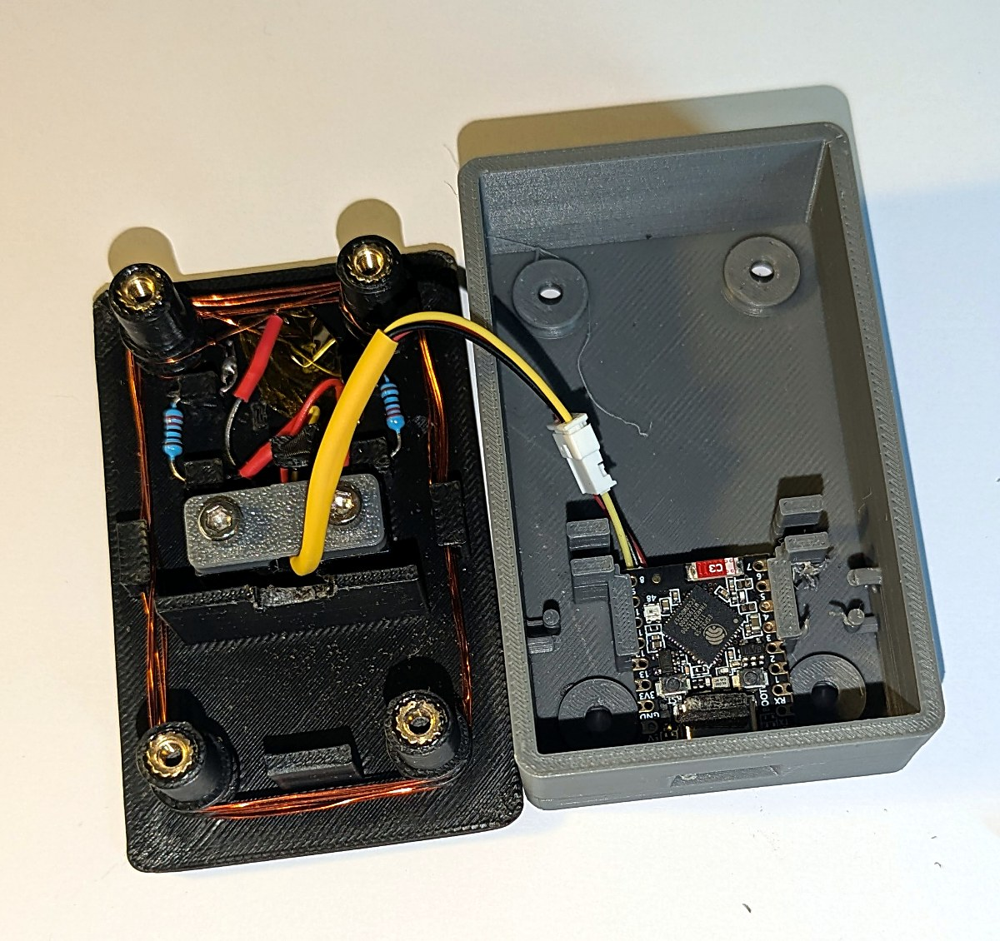
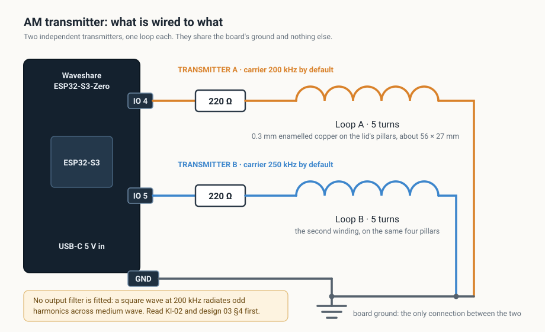

# ESP32-S3 AM Transmitter

An ESP32-S3 plays internet radio over Wi-Fi and re-broadcasts it as an
amplitude-modulated longwave carrier on a GPIO pin, so an ordinary AM receiver
in the same room picks it up. Two independent transmitters, two stations, one
board. It is driven entirely from a web page it serves itself, or from a serial
console, and it lives in a 3D-printed case whose lid is the antenna.

**[There is a project page with a demo video.](https://garethdavieslondon.github.io/esp32-am-transmitter/)**



## Read this before you build one

**This is a radio transmitter, and two facts about it are not negotiable.**

- **It transmits in a licensed broadcast band.** The default carrier is
  200 kHz, which is inside the longwave broadcast band, 2 kHz from BBC Radio 4
  on 198 kHz. Deliberate radiation there is licensed in the UK and in most
  other countries, and this project holds no licence. It is built to be heard
  by a receiver on the same table: an inductive loop beside the radio, not an
  antenna. **What you radiate, and the rules where you live, are yours to
  check.**
- **There is no output filter in this build.** The carrier is a square wave,
  so it radiates odd harmonics at 600 kHz, 1 MHz and upward, across the whole
  medium-wave band. At this power, with the loop next to the receiver, that
  was judged acceptable by ear. **It has never been measured on a spectrum
  analyser.** Raise the drive, lengthen the antenna or drop the series
  resistor and the harmonics rise with it. The Technical Manual gives a
  low-pass network to fit if you do.

## How it is wired



Per transmitter: a GPIO pin, a 220 ohm resistor, a five-turn loop wound on the
lid's pillars, back to ground. The two chains share the ground and nothing
else.

## What it does

- **Two transmitters.** Separate stations, carrier frequencies, modulation
  depth, audio low-pass, gain, carrier level and power-on station. They share
  one Wi-Fi connection and one station list.
- **Proper AM.** Duty-cycle modulation linearised through an arcsine table,
  because the obvious scheme barely modulates at all. A 6th-order low-pass,
  a fractional resampler with a fill controller, a peak limiter and a loudness
  AGC that brings stations within about 2 dB of each other.
- **A web interface** for everything: stations, directory search, both
  transmitters' settings, a test tone, Wi-Fi, diagnostics.
- **A serial console** that can do everything the page can, so a board whose
  network is broken is still reachable over USB.
- **Carrier level and fading**, if you want it to sound like a distant station.
- **A printed case** whose lid carries both loop windings on four pillars.

## Quick start: flash a board

You need a Waveshare ESP32-S3-Zero (or another ESP32-S3), a USB-C data cable,
and Python.

```
pip install esptool
python -m esptool --chip esp32s3 -p COM5 write_flash 0x0 binaries/amtx-v1.0-merged.bin
```

Use your own port (`/dev/ttyACM0` and similar elsewhere), and the board's own
USB-C socket rather than a separate serial adapter.

Then power it up, join the Wi-Fi network **`AMTX-Setup`** it raises, and follow
the page that opens. Full walk-through in the **Build Manual**.

## Build one

**[docs/manuals/build_manual.pdf](docs/manuals/build_manual.pdf)** is the
end-to-end guide: parts, printing, heat-set inserts, winding the antenna,
wiring, assembly, flashing, first boot, and what to do when it does not work.

| Manual | For |
| ------ | --- |
| [Build](docs/manuals/build_manual.pdf) | Making one from parts |
| [Installation](docs/manuals/installation_manual.pdf) | Toolchain, building the firmware from source, flashing |
| [User](docs/manuals/user_manual.pdf) | Driving it once it runs |
| [Technical](docs/manuals/technical_manual.pdf) | How the firmware works, for changing it |

## What is in here

```
firmware/     ESP-IDF v5.3 project: the whole transmitter
tools/        Desktop tools, Python + tkinter:
                esp-serial-monitor   serial console, system and CLI panes split
                esp-flasher          finds, probes, flashes and monitors a board
                amtx-programmer      the flasher plus a tab that sets the board up
case/          The printed case: STEP for editing, STL for printing
binaries/      A flashable build, merged and as separate images
docs/          The manuals, as PDF and Markdown
```

## What has actually been tested

This project tries to be honest about the difference between "built" and
"proven". As of v1.0:

- **Runs on hardware.** Two stations playing at once, heard on an AM receiver,
  each decoder sustaining full rate with the modulator never starving. The web
  interface, the console, station switching, Wi-Fi joining and the diagnostics
  have all been used on a real board.
- **Printed and assembled.** The case has been printed and built more than
  once. The current revision fixes what the last print got wrong; **it has not
  itself been printed yet**, and nothing in it needs support.
- **Not measured.** Nothing has been on a spectrum analyser or a scope. The
  harmonic content, radiated field strength and modulation depth are unknown.
- **Not tested on hardware:** the factory-reset button gesture (hold BOOT for
  five seconds). The code is built and the other two routes to the same
  function are straightforward, but nobody has pressed the button yet.

## Licence

GPL-3.0. See [LICENSE](LICENSE).

The MP3 decoder (libhelix) is fetched by the build from the ESP component
registry and carries its own licence. The board's dimensions came from
Waveshare's published drawing for the
[ESP32-S3-Zero](https://www.waveshare.com/wiki/ESP32-S3-Zero), which is not
reproduced here.

## About this repository

It is the public mirror of a working repository where the engineering record
lives: design documents, the registers of known issues and lessons, the
parametric CAD source for the case, and the reasoning behind each decision.
What is published here is the product: source, tools, manuals, geometry and a
binary.

Issues and pull requests are welcome, though development happens elsewhere and
lands here in releases.
